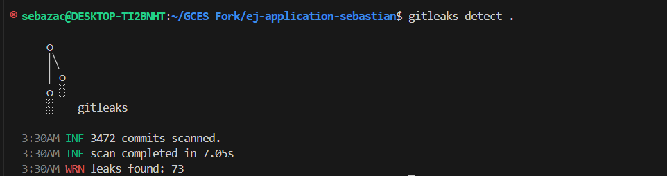
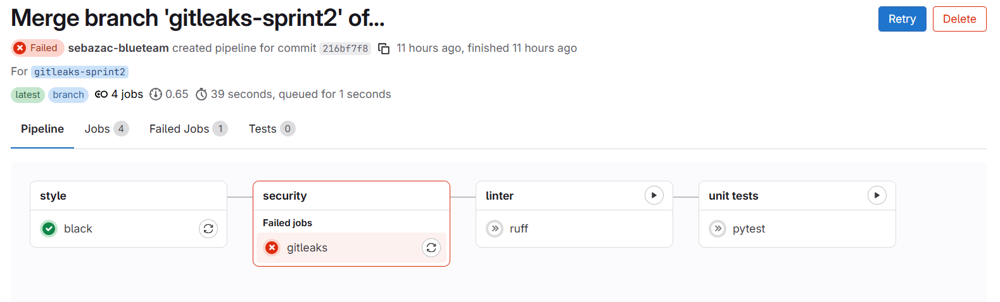
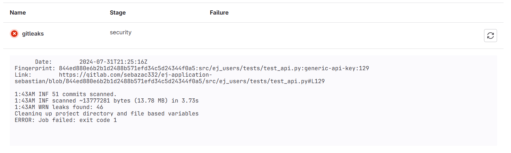

# Diário de Bordo – Sebastián Zuzunaga

**Disciplina:** Gestão de Configuração e Evolução de Software
**Equipe:** OWASP (Blue Team)
**Comunidade/Projeto de Software Livre:** OWASP (ej-application)

---

## Sprint 1 – [23/09/2025 – 07/10/2025]

### Resumo da Sprint

Busca de ferramentas de segurança para pipeline CI/CD, estudo das funcionalidades da ferramenta Gitleaks e implementação na pipeline.

### Atividades Realizadas

| Data  | Atividade                                   | Tipo (Código/Doc/Discussão/Outro) | Link/Referência | Status    |
| ----- | ------------------------------------------- | --------------------------------- | --------------- | --------- |
| 03/10 | Busca de ferramentas de segurança            | Estudo                            | –               | Concluído |
| 05/10 | Instalação e execução inicial de Gitleaks | Código                            | [Instalar e rodar](https://devsecopsschool.com/blog/gitleaks-a-comprehensive-devsecops-tutorial/)   | Concluído |
| 08/10 | Implementação de Gitleaks em pipeline CI/CD      | Código                         | [Gitleak pipeline](https://dev.to/sirlawdin/secret-scanning-in-ci-pipelines-using-gitleaks-and-pre-commit-hook-1e3f)   | Concluído |

### Maiores Avanços

* Instalar e executar localmente a ferramenta Gitleaks.
* Implementar a ferramenta Gitleaks para uma pipeline existente.
* Entender como as tarefas são executadas em uma pipeline.

### Maiores Dificuldades

* Runners que executam tarefas com a tag k8s não existem no fork, foi resolvido comentando essas tags.

### Aprendizados

#### Instalação de Gitleaks.

##### Instalação regular:

```
sudo apt install gitleaks

```

##### Instalação manual:

```
cd ~

curl -sSL https://github.com/gitleaks/gitleaks/releases/download/v8.19.1/gitleaks_8.19.1_linux_x64.tar.gz -o gitleaks.tar.gz

tar -xvzf gitleaks.tar.gz

sudo mv gitleaks /usr/local/bin/

gitleaks version

```
#### Como executar localmente Gitleaks, visualizar os segredos encontrados e como gerar relatório.

##### Execução local simples:

```
gitleaks detect .

```

**Resultado:**



##### Gerar relatório detalhado

```
gitleaks detect -v --report-path gitleaks-report.json

```

**Resultado:**

Relatório gera múltiplas entradas com esta forma, cada um representa um segredo encontrado.

```
{
  "Description": "Detected a Generic API Key, potentially exposing access to various services and sensitive operations.",
  "StartLine": 129,
  "EndLine": 129,
  "StartColumn": 6,
  "EndColumn": 83,
  "Match": "SECRET_ID = \"8d969eef6ecad3c29a3a629280e686cf0c3f5d5a86aff3ca12020c923adc6c92\"",
  "Secret": "8d969eef6ecad3c29a3a629280e686cf0c3f5d5a86aff3ca12020c923adc6c92",
  "File": "src/ej_users/tests/test_api.py",
  "SymlinkFile": "",
  "Commit": "a131ff4da6b80049afbb4416ea42fc22890f98d4",
  "Entropy": 3.5674453,
  "Author": "David Carlos",
  "Email": "ddavidcarlos1392@gmail.com",
  "Date": "2024-07-19T02:42:35Z",
  "Message": "Merge branch 'merge-authentication-flow-issue-1470' into 'develop'\n\nAdds support to authenticate users using an external identity provider, for example, the Brasil Participativo platform\n\nSee merge request pencillabs/ej/ej-application!352\n\nCo-authored-by: Giovanni Giampauli \u003cgiovanni.acg@gmail.com\u003e\n\ncommit fb99b0b93981f962c34a2eee1d3d59f048b5e3fa\nAuthor: David Carlos \u003cddavidcarlos1392@gmail.com\u003e\nDate:   Fri Jul 19 02:42:34 2024 +0000\n\nAdds support to authenticate users using an external identity provider, for example, the Brasil Participativo platform",
  "Tags": [],
  "RuleID": "generic-api-key",
  "Fingerprint": "a131ff4da6b80049afbb4416ea42fc22890f98d4:src/ej_users/tests/test_api.py:generic-api-key:129"
}


```

- **Description:** Descreve o tipo de segredo detectado.
- **File:** Caminho do arquivo onde o segredo foi encontrado.
- **StartLine/EndLine:** Intervalo onde o segredo aparece.
- **Match/Secret:** Trecho do valor detectado.
- **RuleID:** Identificador interno da regra que disparou o alerta.
- **Entropy:** Mede o "nível de aleatoriedade" da string, valores altos indicam chaves ou hashes.
- **Tags:** Palavras-chave relacionadas ao tipo de segredo.
- **Commit:** Hash do commit onde o segredo apareceu.
- **Author:** Quem introduziu o segredo.
- **Date:** Quando o segredo foi introduzido.
- **Line:** Mostra o código completo da linha para contexto.

#### Como adicionar o Gitlab ao fluxo de trabalho de um pipeline.

```

stages:
    - style
    - security
    - linter
    - unit tests
    - build
    - deploy
    - e2e tests

gitleaks:
  stage: security
  image:
    name: zricethezav/gitleaks
    entrypoint: [""]
  script: 
    - gitleaks detect --source . --verbose --report-path gitleaks-report.json
    - |
      if [ -s gitleaks-report.json ] && grep -q '"findings":\s*\[' gitleaks-report.json; then
        echo "Gitleaks found potential secrets — failing pipeline."
        cat gitleaks-report.json
        exit 1
      else
        echo "No new secrets found."
      fi


```

Este código cria um relatório e, em seguida, verifica que se ele existe e não é vazio se essas duas condições são atendidas, então significa que os segredos foram encontrados, por isso uma mensagem de erro será dada e o pipeline falhar.

**Resultado:**





### Plano Pessoal para a Próxima Sprint

* [ ] Continuar o estudo de Gitleaks.
* [ ] Criar runner com a tag k8s para descomentar partes do código.
* [ ] Verificar onde estão os segredos e como resolvê-los.