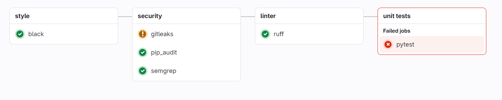
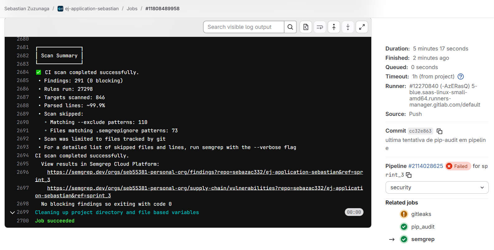

# Diário de Bordo – Sebastián Zuzunaga

**Disciplina:** Gestão de Configuração e Evolução de Software
**Equipe:** OWASP (Blue Team)
**Comunidade/Projeto de Software Livre:** OWASP (ej-application)

---

## Sprint 3 – [07/09 até 22/10]

### Resumo da Sprint

Neste sprint se tentaou implementar no pipeline de EJ-Application a ferramenta de semgrep para análise estática de código, depois de seguir os passos fornecidos pela mesma organização de semgrep se consegue implementar com sucesso na pipeline.

### Atividades Realizadas

| Data  | Atividade                                   | Tipo (Código/Doc/Discussão/Outro) | Link/Referência | Status    |
| ----- | ------------------------------------------- | --------------------------------- | --------------- | --------- |
| 16/10 | Pesquisa de semgrep         | Estudo                            | [semgrep repo](https://github.com/semgrep/semgrep)               | Concluído |
| 20/10 | Busca de tutorial sobre implementação em pipeline gitlab | Estudo                            | [semgrep tutorial](https://www.youtube.com/watch?v=ObpgD-PxSWY)    | Concluído |
| 21/10 | Primeira criação de pipeline com semgrep      | Código                         | [semgrep primeira tentativa](https://gitlab.com/sebazac332/ej-application-sebastian/-/commit/aff1e24ba677fc1577e0cb3c25ba3c1f6d925640)| Concluído |
| 22/10 | Criação bem sucedida de pipeline com semgrep      | Código                         | [semgrep final](https://gitlab.com/sebazac332/ej-application-sebastian/-/commit/cc32e8634b20f6bed9daf43520238e964d515db8)   | Concluído |

### Maiores Avanços

* Criação de pipeline usando semgrep na etapa de segurança.
* Integração da dashboard de semgrep com o repositório do projeto.
* Foi possível implementar várias ferramentas na etapa de segurança.

### Maiores Dificuldades

* As regras padrão do semgrep só permitiam a execução dos jobs sob certas circunstâncias, foi resolvido alterando-as na pipeline.
* Tentou-se executar pip-audit também no pipeline mas não foi possível, só resolveu-se usando a implementação disponibilizada por colegas de grupo no documento do sprint 3.

### Aprendizados

* Como usar semgrep em uma pipeline.
* Como criar variáveis em gitlab para ci/cd.
* Como integrar semgrep app com um repositório em gitlab.
* Permitir falhas em um pipeline sem interrompê-la para permitir que todos os trabalhos sejam executados.

### Implementação

**Semgrep na pipeline:**
```yaml
semgrep:
  stage: security
  image: semgrep/semgrep
  script: semgrep ci
  rules:
  - when: always
  variables:
    
    SEMGREP_APP_TOKEN: $SEMGREP_APP_TOKEN
    GITLAB_TOKEN: $PAT

  allow_failure: true
```

**Resultado da pipeline:**



**Job de semgrep da pipeline:**



**Tipos de achados:**

**Intermedio:**


**Alto:**


**Critico:**


### Plano Pessoal para a Próxima Sprint

* [ ] Verificar qual foi o erro de implementação do pip-audit.
* [ ] Tentando modificar as regras de semgrep.
* [ ] Explorar funcionalidades da dashboard de semgrep.