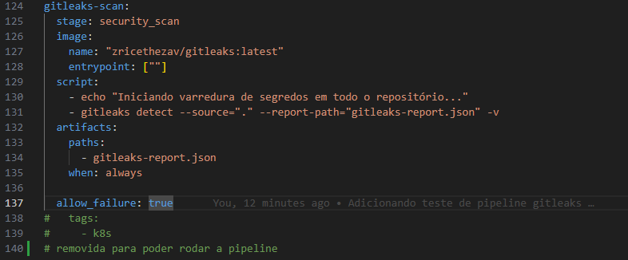
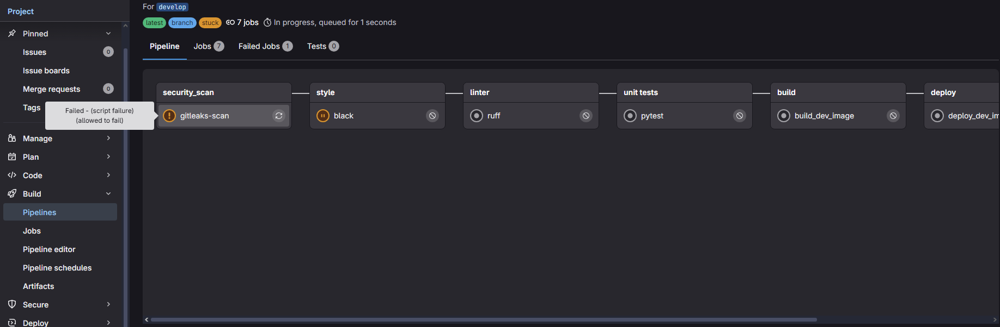
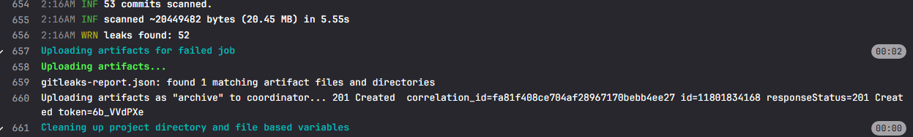

# 📝 Relatório de Contribuição – Sprint 2

**Disciplina:** Gestão de Configuração e Evolução de Software

**Equipe:** OWASP (Times Blue e Red)

**Período da Sprint:** 07/10/2025 - 22/10/2025

---

## 1. Objetivos da Sprint

#### Blue Team

**Seleção do Arsenal de Segurança e Início da Implementação de DevSecOps**

* Realizar uma pesquisa comparativa de ferramentas de segurança *open-source* nas categorias: **Detecção de Segredos, Análise Estática (SAST), Análise de Dependências (SCA) e Infraestrutura como Código (IaC)**.
* Selecionar o "arsenal" de ferramentas ideal para o projeto EJ-Platform, justificando a escolha do conjunto com base em critérios de complementaridade, performance e adequação ao projeto.
* Integrar a primeira ferramenta de segurança selecionada ao pipeline de CI/CD no GitLab, configurando um novo *job* e validando a sua execução automática a cada `push`.
* Documentar todo o processo de pesquisa e a decisão final em um relatório consolidado.
  
### Red Team

- Explorar ataques sobre o EJ (Red Team): SQL Injection, CSRF, XSS e Clickjacking
- Estudar sobre:
    - IDOR
    - Sessões / Cookies inseguros
    - Brute force / Rate limiting

---

## 2. Entregas Coletivas

| Entrega                                                             | Status (Concluído/Parcial/Pendente) | Link/Referência        | Observações                       |
| ------------------------------------------------------------------- | ----------------------------------- | ---------------------- | --------------------------------- |
| Análise da Plataforma sobre SQL Injection, XSS, CSRF e Clickjacking | Concluído                           |                        |                                   |
| Estudo e Implementação de Ferramentas de Segurança no CI/CD         | Concluído                           |                        | Gitleaks e Bandit testados        |

---

## 3. Contribuições Individuais

| Integrante        | Contribuições                             | Links (PRs, Issues, Docs) | Observações |
| ----------------- | ----------------------------------------- | ------------------------- | ----------- |
| Miguel Arthur     | Documentação e Tabela Comparativa  | [()](link) |             |
| Daniel Rocha     | Documentação e Resultados Parciais da Utilização do GitLeaks na pipeline do projeto, além dos testes locais utilizando o gitleaks  | [Diário Daniel](../diarios/190104821/sprint_3_diario.md) |   Os resultados podem ser vistos na aba **Exemplos práticos**          |
| Ana Carolina     | Análise de dependências com pip-audit | [Pipeline pip-audit](https://gitlab.com/caroll_mf/ej-application/-/commit/3f749028) | Pipeline focada em segurança de dependências |


---

## 4. Maiores Avanços

### Blue Team

### Pesquisa e Seleção do Arsenal de Segurança

Dando continuidade ao plano de implementação de um pipeline de DevSecOps, o objetivo desta sprint foi realizar uma pesquisa aprofundada para selecionar o conjunto ideal de ferramentas de segurança para o projeto EJ-Platform.

A metodologia consistiu em dividir a pesquisa em quatro categorias essenciais, visando criar uma estratégia de **defesa em camadas**, onde cada ferramenta possui uma responsabilidade clara e complementar:

1.  **Detecção de Segredos:** Prevenir o vazamento de credenciais e chaves de API.
2.  **Análise Estática de Segurança (SAST):** Encontrar vulnerabilidades no código-fonte da aplicação.
3.  **Análise de Composição de Software (SCA):** Identificar vulnerabilidades em dependências de terceiros.
4.  **Segurança de Infraestrutura como Código (IaC):** Garantir que a configuração dos nossos contêineres (`Dockerfile`) segue as boas práticas de segurança.


### Ferramentas de Segurança Pesquisadas e Avaliadas

Nesta sprint, a equipe realizou uma pesquisa aprofundada e uma análise comparativa de ferramentas *open-source* em quatro categorias distintas para compor um arsenal de segurança coeso. O objetivo foi avaliar as melhores opções para cada camada de defesa do nosso pipeline de CI/CD.

* **Detecção de Segredos (Secrets Detection)**
    * **Gitleaks:** Scanner rápido baseado em regras para encontrar credenciais e chaves de API expostas no código.
    * **TruffleHog:** Ferramenta de análise profunda que busca segredos com base em regras e na entropia dos dados.

* **Análise Estática de Segurança (SAST)**
    * **Bandit:** Analisador focado em encontrar vulnerabilidades comuns e de baixo nível em código Python.
    * **Semgrep:** Motor de análise de código moderno e flexível, com uma vasta base de regras para frameworks web como o Django, capaz de encontrar vulnerabilidades complexas.

* **Análise de Composição de Software (SCA)**
    * **pip-audit:** Ferramenta oficial do ecossistema Python que verifica dependências contra a base de dados de vulnerabilidades aberta (OSV).
    * **Safety:** Ferramenta tradicional que verifica dependências contra sua própria base de dados de vulnerabilidades.

* **Segurança de Infraestrutura como Código (IaC)**
    * **Trivy:** Scanner multifuncional que analisa `Dockerfiles` em busca de más práticas de segurança.
    * **Checkov:** Ferramenta especializada em IaC com uma cobertura extensiva de políticas de segurança para diversas plataformas.


      A tabela a seguir consolida os resultados desta pesquisa, comparando as principais ferramentas open-source para cada categoria com base em sua funcionalidade, vantagens, desvantagens e, crucialmente, seu fator decisivo para a integração em nosso pipeline.

### Tabela Comparativa de Ferramentas de Segurança

| Categoria | Ferramenta | Breve Descrição | Comparação (Fator Decisivo) |
| :--- | :--- | :--- | :--- |
| **Detecção de Segredos** | [Gitleaks](https://github.com/gitleaks/gitleaks) | Scanner rápido que busca segredos e credenciais em repositórios Git, utilizando uma base de regras de expressões regulares. | **Melhor para CI/CD:** É extremamente rápido e leve por ser um binário único (escrito em Go). Sua simplicidade o torna ideal para ser executado a cada `push` sem impactar a velocidade do pipeline. É o padrão da indústria para prevenção rápida. |
| **Detecção de Segredos** | [TruffleHog](https://github.com/trufflesecurity/trufflehog) | Scanner profundo que vai além de regras, analisando a entropia dos dados para encontrar chaves com formatos desconhecidos. | **Melhor para Auditorias Profundas:** Sua capacidade de encontrar segredos com base na aleatoriedade (entropia) é mais poderosa, mas o torna significativamente mais lento. É uma ferramenta excelente para uma varredura completa e periódica, mas menos ideal para o pipeline do dia a dia. |
| **SAST** | [Bandit](https://github.com/PyCQA/bandit) | Ferramenta de SAST focada em encontrar problemas de segurança comuns em código Python, analisando a Árvore de Sintaxe Abstrata (AST). | **Melhor para Simplicidade em Python:** É uma ferramenta "clássica", muito simples de rodar (`pip install` e executar). Seu foco exclusivo em Python garante uma boa detecção de erros comuns no ecossistema (ex: uso de `pickle`, senhas fixas no código). |
| **SAST** | [Semgrep](https://github.com/semgrep/semgrep) | Motor de análise de código moderno e multilíngue com uma sintaxe de regras poderosa e intuitiva. | **Melhor em Poder e Flexibilidade:** É a evolução do SAST. Suas regras são mais fáceis de entender e customizar. A enorme base de regras da comunidade e a capacidade de se adaptar a qualquer padrão de código o tornam mais poderoso e "à prova de futuro" que o Bandit. |
| **SCA** | [pip-audit](https://github.com/pypa/pip-audit) | Ferramenta que escaneia as dependências do projeto em busca de vulnerabilidades, utilizando o banco de dados aberto e de alta qualidade OSV (Open Source Vulnerability). | **Melhor por usar um Padrão Aberto:** Sendo da PyPA (a mesma autoridade que cuida do `pip`), usa o banco de dados OSV, que é um padrão da indústria mantido pelo Google. Isso garante dados de vulnerabilidade transparentes e de alta qualidade, sem restrições comerciais. |
| **SCA** | [Safety](https://github.com/pyupio/safety) | Uma das ferramentas de SCA mais conhecidas para Python, que verifica as dependências instaladas contra seu próprio banco de dados de vulnerabilidades (Safety-DB). | **Modelo Comercial:** Sua principal desvantagem é que a base de dados gratuita tem um atraso deliberado de 30 dias na divulgação de novas vulnerabilidades, incentivando a assinatura da versão paga. Para um projeto acadêmico, o `pip-audit` é uma escolha mais alinhada. |
| **IaC** | [Trivy](https://github.com/aquasecurity/trivy) | Scanner de vulnerabilidades multifuncional. Além de imagens de contêineres, ele também consegue escanear arquivos de configuração (como `Dockerfile` e `docker-compose.yml`) em busca de más práticas. | **Melhor pela Consolidação de Ferramentas:** A grande vantagem é que poderemos usar a **mesma ferramenta** para escanear tanto a nossa IaC (Dockerfile) quanto as imagens Docker em uma sprint futura. Isso reduz a complexidade do pipeline e o número de ferramentas para aprender. |
| **IaC** | [Checkov](https://github.com/bridgecrewio/checkov) | Ferramenta especializada em IaC que verifica arquivos de configuração contra centenas de políticas de segurança e boas práticas. | **Melhor em Cobertura Específica para IaC:** É mais poderoso e tem uma quantidade maior de regras *específicas* para IaC do que o Trivy. É a escolha de especialistas em nuvem, mas talvez seja um exagero para o nosso escopo, que se limita a Dockerfiles e Docker Compose. |

### Implementação do pip-audit - Segurança de Dependências


#### Como o pip-audit funciona

O pip-audit opera através de um processo simples mas eficaz:
1. Coleta todas as dependências do projeto
2. Consulta o banco de dados OSV (Open Source Vulnerability) mantido pelo Google
3. Compara as versões das dependências com vulnerabilidades conhecidas
4. Gera um relatório claro indicando quais pacotes necessitam de atualização

#### Nossa Implementação no EJ-Platform

**Desafio técnico:** O projeto EJ-Platform utiliza Poetry como gerenciador de dependências, enquanto o pip-audit tradicionalmente trabalha com arquivos requirements.txt. Foi necessário desenvolver uma solução de integração entre os dois sistemas.

**Solução implementada:**
```yaml
dependency-audit:
  stage: security
  image: python:3.11-slim
  script:
    - pip install pip-audit
    - pip install "poetry==1.8.3"
    - poetry export -f requirements.txt --output requirements.txt --without-hashes
    - pip-audit -r requirements.txt --format=columns
  allow_failure: false
```


**Implementação Prática:**

(COLOCAR O QUE FOI IMPLEMENTADO NA PRATICA)

**Documentação Produzida:**

(REFERENCIAR OS DOCUMENTOS QUE FORAM PRODUZIDOS)

##### Exemplo de pipeline:

- Código usado na pipeline.



- Fluxo da pipeline.



-----

##### Fluxo resultante



Como esperado, a pipeline se encerrou com erro, analisando 53 commits e identificando 52 leaks

- Job de (COLOCAR A FERRAMENTA QUE FOI IMPLEMENTADA).


### Red Team

#### Ataque sobre SQL Injection

Foi utilizado a ferramenta [BurpSuite Community Edition](https://portswigger.net/burp) para a obtenção das URLs de requisições GET e POST, na aba *Proxy/Intercept*, clicando na opção de abrir Browser, que irá abrir um browser Chromium normal, a partir dele entrei na conta fake de testes como usuário (user@user.com) presente no banco de dados postgres através do comando `inv docker-exec 'inv db-fake'` e realizei ações comuns do usuário como criar um dashboard, personas, alterar informações do usuário logado, etc.

O [BurpSuite](https://portswigger.net/burp) manteve um histórico de todas as requisições feitas nesta sessão na aba *Proxy/HTTP History*, foi selecionado todas as requisições desse histórico e salvo em um arquivo xml que será passado como argumento para o [SQLMap](https://sqlmap.org/)

Para o teste de fato foi utilizado a ferramenta [SQLMap](https://sqlmap.org/), muito utilizada para ataques de SQL Injection com muitas opções avançadas e suporte a vários banco de dados (Oracle, Postgres, MySQL, etc), foi executado o seguinte comando:

`sqlmap -l burg_log.xml --batch --level 5 --risk 3 --dbms postgres`

- `-l`: Comando especifico para obter alvos através de um arquivo log do BurpSuite ou WebScarab
- `burg_log.xml`: Arquivo de log obtido através do Proxy do BurpSuite
- `--batch`: Não perguntar por confirmações e selecionar as opções padrões
- `--level 5`: Nível máximo de quantidade de testes a serem realizados
- `--risk 3`: Nível de risco máximo, com alta chance de ser detectado (não é importante neste caso)
- `--dbms postgres`: Informa o SQLMap para usar apenas scripts especificos para postgres, usado na EJ Application, se não informado o [SQLMap](https://sqlmap.org/) irá tentar scripts de vários banco de dados diferentes como Oracle, MySQL e outros.

Não foram encontrados pontos de falha SQL Injection utilizando [SQLMap](https://sqlmap.org/), apesar de ele ter encontrado alguns falsos positivos: 

- Em localhost/boards/teste/conversations/add/ usando SQL Injection no User-Agent com técnicas boolean blind based
- Em localhost/boards/teste/conversations usando SQL Injection no Cookie de sessionid com técnicas boolean blind based

Esses falsos positivos foram identificados com a técnica de boolean blind based que injeta scripts SQL em objetos dentro da requisição e espera uma resposta diferente da padrão, se houve uma resposta diferente então o ataque é considerado bem sucedido, mas isso pode ocorrer quando uma página possuí elementos dinâmicos, provavelmente o [SQLMap](https://sqlmap.org/) verificou que a página mudou, mas ao tentar fazer um exploit (acesso ao banco de dados ou obter informações) através desta técnica ele não teve resultados.

```
Target URL,Place,Parameter,Technique(s),Note(s)
http://10.0.0.5:8000/boards/teste/conversations/,Cookie,sessionid,B,false positive or unexploitable
http://10.0.0.5:8000/boards/teste/conversations/add/,User-Agent,User-Agent,B,false positive or unexploitable
```

Vídeo de demonstração: 
<iframe width="1310" height="737" src="https://www.youtube.com/embed/QMBZJynQwfU" title="EJ Application Teste SQL Injection" frameborder="0" allow="accelerometer; autoplay; clipboard-write; encrypted-media; gyroscope; picture-in-picture; web-share" referrerpolicy="strict-origin-when-cross-origin" allowfullscreen></iframe>

#### Ataque sobre XSS (Vulnerabilidade Encontrada)

* **Tipo de vulnerabilidade:** XSS Persistente (Stored XSS).
* **Localização:** Campos Rich Text. O conteúdo salvo é posteriormente renderizado no navegador sem escaping adequado.
* **Causa raiz:** Falta de sanitização no backend + renderização com flags que desabilitam escaping, permitindo que conteúdo armazenado seja interpretado como código no cliente.
* **Evidência:** Conteúdo malicioso foi persistido no banco e provoca execução de script quando a página afetada é carregada por um usuário. (passos e payloads foram removidos deste documento).
* **Impacto potencial:** Roubo de cookies de sessão, execução de ações em nome do usuário, manipulação de feedbacks/entradas, redirecionamentos e degradação da confiança na plataforma.
* **Recomendações:**
    * Implementar sanitização server-side robusta para entradas Rich Text (usar bibliotecas maduras e listas de permissão de tags/atributos).
    * Evitar uso irrestrito de flags que desabilitem escaping; garantir que qualquer conteúdo marcado como seguro seja validado e sanitizado.

Link: [Relatório Completo de Reprodução e Análise da Vulnerabilidade](https://unbbr-my.sharepoint.com/:b:/g/personal/221008703_aluno_unb_br/ESkTAolLP5ZHqdUQFBZEjyAB9DxryON9Fn3o2vW0_7rRzA)

**Obs:** O relatório completo é um arquivo privado no OneDrive e, até o momento, só está liberado para a professora da disciplina.

#### Ataque sobre CSRF
**O que é CSRF (Cross-Site Request Forgery)**

CSRF é uma técnica de ataque em que um site malicioso faz com que o **navegador de uma vítima autenticada** envie requisições indesejadas a um site confiável onde a vítima já possui sessão ativa. O atacante explora o fato de que **cookies e outras credenciais gerenciadas automaticamente pelo navegador** são incluídas em requisições originadas do contexto do usuário.

**Cenário de teste descrito**

1. **Testar via página HTML separada** — Foi criado um arquivo HTML que tenta enviar um POST para `http://localhost:8000/api/v1/votes/` a partir do mesmo navegador onde está logado como admin. Ao submeter a requisição pelo HTML, o servidor respondeu com `401 Unauthorized` e o JSON `{"detail": "Credenciais de autenticação não foram fornecidas."}`.

**Saída observada**

```
Vote List
POST /api/v1/votes/
HTTP 401 Unauthorized
Allow: GET, POST, HEAD, OPTIONS
Content-Type: application/json
Vary: Accept
WWW-Authenticate: Bearer realm="api"

{
    "detail": "Credenciais de autenticação não foram fornecidas."
}
```

- O comportamento indica que o endpoint **exige um header `Authorization: Bearer <token>`** para autenticação, ou outro esquema que não é enviado automaticamente pelo navegador quando a requisição é iniciada de outro site.
- Quando a requisição foi disparada a partir do HTML externo, **o navegador não enviou qualquer credencial** (nem cookie de sessão nem header Authorization), logo o servidor respondeu `401`.
- Isso **implica** que o mecanismo de autenticação atual **não é baseado em cookies de sessão enviados automaticamente**. Como resultado, o vetor clássico de CSRF **falhou**.

#### Ataque sobre Clickjacking

* **Tipo de vulnerabilidade:** Clickjacking (UI Redress Attack).  
* **Localização:** Páginas públicas e autenticadas da aplicação EJ (testes realizados no endpoint `/login` e em outras rotas acessíveis sem proteção de cabeçalhos).  
* **Causa raiz:** Ausência dos cabeçalhos de segurança `X-Frame-Options` e `Content-Security-Policy: frame-ancestors`, o que permite que a aplicação seja embutida dentro de um `<iframe>` externo.  
* **Descrição do ataque:**  
  O atacante pode criar uma página maliciosa contendo um `iframe` invisível ou semitransparente que carrega a aplicação legítima. Sobre este `iframe`, ele posiciona elementos visuais falsos (ex.: "Clique aqui para ganhar um prêmio"). Quando o usuário clica nesses elementos, o clique é redirecionado para o botão real da aplicação — por exemplo, um botão de login, confirmação ou envio — sem o conhecimento do usuário.  

* **Prova de Conceito (PoC):**  
  Foi criado o arquivo `poc.html` contendo um iframe apontando para a página de login da EJ Application: [Relatório Completo de ataque clickjacking](https://www.overleaf.com/project/68e580a087a88333ae844f6e)

### **Ataque sobre IDOR (Insecure Direct Object Reference)**

#### O que é IDOR?

*IDOR (Insecure Direct Object Reference)* é uma falha de controle de acesso onde um *site permite que um usuário acesse ou modifique dados que não pertencem a ele*, simplesmente ao manipular o valor de um identificador (ID) em uma requisição, como um número na URL. Se a aplicação não verificar se o usuário logado tem permissão para acessar o objeto com aquele ID, a vulnerabilidade existe.

#### Cenário de teste descrito

1.  **Preparação** — Foi feito o login como `admin@admin.com` para acessar o painel de administração (`/admin/`) e descobrir o ID numérico de usuários.
2.  **Teste** — Em um navegador separado (janela anônima), foi feito o login como um usuário comum (`user@user.com`). Em seguida, foi feita uma tentativa de acesso direto ao perfil do admin, forçando a URL para `http://localhost:8000/users/34/`.
3.  **Resultado** — O servidor respondeu com um erro **`404 Page not found`**.

#### Saída observada

A aplicação retornou a página de erro padrão do Django, indicando que a rota solicitada não existe. A lista de URLs válidas exibida na página de erro confirmou que não há um padrão de URL no formato `/users/<ID>/`.

* E esse comportamento indica que a aplicação não expõe perfis de usuário através de uma URL direta com o ID numérico.
* Como a rota não existe, o resultado prático é que este vetor de ataque específico de IDOR não é explorável.

### **Ataque sobre Sessões / Cookies Inseguros**

#### O que são Sessões / Cookies Inseguros?

Refere-se a falhas no gerenciamento do cookie que identifica a sessão de um usuário logado. Se o cookie não for configurado com atributos de segurança (flags), ele pode ser interceptado em redes inseguras ou roubado por scripts maliciosos.

#### Cenário de teste descrito

1.  **Preparação** — Foi feito o login na aplicação com um usuário.
2.  **Teste** — Utilizando as Ferramentas de Desenvolvedor do navegador (`F12`), a aba `Application` (ou `Storage`) foi usada para inspecionar os cookies do site.
3.  **Resultado** — O cookie `sessionid` foi localizado e seus atributos de segurança foram analisados.

#### Saída observada

A inspeção do cookie `sessionid` revelou os seguintes atributos:
* **`HttpOnly`**: `True`
* **`Secure`**: `False`
* **`SameSite`**: `Lax`

* O comportamento indica que o cookie de sessão está corretamente protegido contra leitura por scripts JavaScript (graças à flag **`HttpOnly`**).
* A flag **`SameSite=Lax`** também é uma boa configuração padrão, oferecendo proteção contra ataques de CSRF.
* No entanto, a flag **`Secure`** está ausente. Isso implica que, em um ambiente de produção real com HTTPS, o cookie poderia ser interceptado, representando uma vulnerabilidade.

### **Ataque sobre Brute Force e Rate Limiting**

* **Tipo de vulnerabilidade:** Brute Force Attack / Ausência de Rate Limiting.
* **Localização:** Endpoints de autenticação, formulários de login, APIs de reset de senha, endpoints de validação OTP/2FA e qualquer ponto de entrada que aceite credenciais de usuário.
* **Causa raiz:** Falta de implementação adequada de mecanismos de rate limiting e controles de segurança que limitam o número de tentativas de autenticação por usuário, IP ou sessão dentro de um período específico de tempo.

#### **Descrição do ataque:**
  
  Ataques de brute force são métodos sistemáticos onde atacantes utilizam ferramentas automatizadas para tentar múltiplas combinações de credenciais até encontrar as corretas. Este tipo de ataque pode se manifestar de várias formas:

  - **Traditional Brute Force**: Tentativas automáticas de múltiplas senhas contra um usuário conhecido
  - **Dictionary Attacks**: Uso de listas de senhas comuns e variações baseadas em pesquisa do alvo
  - **Credential Stuffing**: Utilização de combinações usuário/senha obtidas de vazamentos de outros sites
  - **Password Spraying**: Teste de uma senha fraca contra múltiplas contas diferentes

#### **Ferramentas comumente utilizadas:**
  - **Hydra (THC-Hydra)**: Cracking de autenticação de rede via brute force, suporta mais de 30 protocolos
  - **John the Ripper**: Ferramenta clássica que combina múltiplas funcionalidades de quebra de senha
  - **Burp Suite**: Suite de testes de segurança web com módulo Intruder para ataques automatizados
  - **Hashcat**: Cracking de senhas acelerado por GPU, capaz de testar milhões de combinações por segundo
  - **Patator**: Ferramenta multi-propósito para brute force em FTP, SSH, SMTP, RDP e outros protocolos

#### **Técnicas de bypass de rate limiting:**
  - **Manipulação de headers**: Alteração de `X-Forwarded-For`, `X-Originating-IP`, `User-Agent`
  - **Rotação de endpoints**: Uso de variações como `/login`, `/Login`, `/LOGIN`
  - **Uso de caracteres especiais**: Inserção de bytes nulos (`%00`, `%0d%0a`, `%20`) em parâmetros
  - **Distribuição via proxies**: Uso de redes Tor, VPNs ou botnets para distribuir requisições
  - **Race conditions**: Exploração de condições de corrida para enviar múltiplas requisições simultaneamente

#### **Exemplo de implementação:**

```
# Exemplo de rate limiting simples em Flask
from flask_limiter import Limiter
from flask_limiter.util import get_remote_address

limiter = Limiter(
    app,
    key_func=get_remote_address,
    default_limits=["200 per day", "50 per hour"]
)

@app.route('/login', methods=['POST'])
@limiter.limit("5 per minute")
def login():
    # Lógica de autenticação
    pass
```

---

## 5. Maiores Dificuldades

* Houve dificuldade de acesso à aplicação Docker via Kali Linux, resolvida ao incluir o IP local da máquina host em `DJANGO_ALLOWED_HOSTS`.
* Houve dificuldade em gerenciar duas sessões simultâneas para testes de IDOR (foi necessário usar navegadores/perfis distintos).
* Houve dificuldade em contornar a sanitização de entradas da API para explorar vulnerabilidades XSS, pois os endpoints estavam bem protegidos, tornando complexo identificar pontos suscetíveis a ataques.
* Configuração inicial dos forks do projeto e entendimento da estrutura complexa do pipeline GitLab.
* Integração de ferramentas de segurança (Gitleaks, Bandit) no fluxo CI/CD existente.

---

## 6. Lições Aprendidas

* Utilização de sqlmap e BurpSuite para testes de injeção e proxy de requisições.
* Sanitização server-side é obrigatória, mesmo com validações client-side.
* Rich Text com renderização sem escape aumenta risco de XSS persistente.
* Ferramentas automatizadas (ex.: sqlmap) ajudam na triagem; análise manual ainda é necessária.
* Domínio completo dos conceitos de CI/CD e estruturação de pipelines GitLab.
* Importância da integração de ferramentas de segurança no ciclo de desenvolvimento.
* Configuração adequada de atributos de segurança em cookies é crucial para proteção.

---

## 7. Planejamento para a Próxima Sprint

### Blue Team

* Implementar ferramentas de segurança no pipeline CI/CD do projeto
* Configurar Gitleaks e Bandit no fluxo de integração contínua
* Desenvolver políticas de segurança para código e dependências
* Criar monitoramento contínuo de vulnerabilidades

### Red Team

* Explorar Ataques:
    * IDOR
    * Sessão (Cookies)
    * Rate-limit / Fuzzing
* Simular phishing no contexto da plataforma
