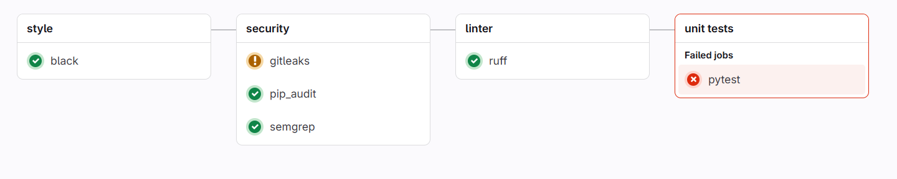
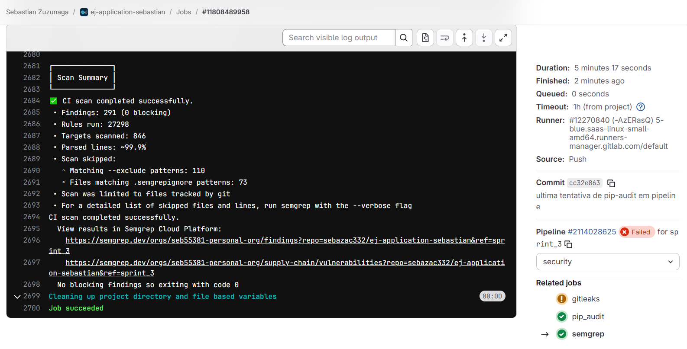

# 📝 Relatório de Contribuição – Sprint 3

**Disciplina:** Gestão de Configuração e Evolução de Software

**Equipe:** OWASP (Times Blue e Red)

**Período da Sprint:** 07/10/2025 - 22/10/2025

---

## 1. Objetivos da Sprint

#### Blue Team

**Seleção do Arsenal de Segurança e Início da Implementação de DevSecOps**

* Realizar uma pesquisa comparativa de ferramentas de segurança *open-source* nas categorias: **Detecção de Segredos, Análise Estática (SAST), Análise de Dependências (SCA) e Infraestrutura como Código (IaC)**.
* Selecionar o "arsenal" de ferramentas ideal para o projeto EJ-Platform, justificando a escolha do conjunto com base em critérios de complementaridade, performance e adequação ao projeto.
* Integrar a primeira ferramenta de segurança selecionada ao pipeline de CI/CD no GitLab, configurando um novo *job* e validando a sua execução automática a cada `push`.
* Documentar todo o processo de pesquisa e a decisão final em um relatório consolidado.
  
### Red Team

* Explorar Ataques:
    * IDOR
    * Sessão (Cookies)
    * Rate-limit / Fuzzing
* Simular phishing no contexto da plataforma
* Validar segurança de controle de acesso (Broken Access Control)
* Análise de autenticação e tokens JWT
---

## 2. Entregas Coletivas

| Entrega                                                             | Status (Concluído/Parcial/Pendente) | Link/Referência        | Observações                       |
| ------------------------------------------------------------------- | ----------------------------------- | ---------------------- | --------------------------------- |
| Simular Phishing no Contexto da EJ                                  | Concluído                           |                        |                                   |
| Estudo e Implementação de Ferramentas de Segurança no CI/CD         | Concluído                           |                        | Gitleaks, pip-audit e trivy       |

---

## 3. Contribuições Individuais

| Integrante        | Contribuições                             | Links (PRs, Issues, Docs) | Observações |
| ----------------- | ----------------------------------------- | ------------------------- | ----------- |
| Miguel Arthur     | Documentação e Tabela Comparativa  | [()](link) |             |
| Daniel Rocha     | Documentação e Resultados Parciais da Utilização do GitLeaks na pipeline do projeto, além dos testes locais utilizando o gitleaks  | [Diário Daniel](../diarios/190104821/sprint_3_diario.md) |   Os resultados podem ser vistos na aba **Exemplos práticos**          |
| Ana Carolina     | Análise de dependências com pip-audit | [Pipeline pip-audit](https://gitlab.com/caroll_mf/ej-application/-/commit/3f749028) | Pipeline focada em segurança de dependências |
| Mateus Vieira     | Abertura de Issue sobre XSS no EJ | [ej-application#1505](https://gitlab.com/pencillabs/ej/ej-application/-/issues/1505) |  |
| Sebastián Zuzunaga     | Análise estática com semgrep | [Pipeline semgrep](https://gitlab.com/sebazac332/ej-application-sebastian/-/pipelines/2114028625) |  |
| Henrique Quenino | Validação de Controle de Acesso (IDOR), Testes de Manipulação de JWT e Análise de Autenticação | [Diário Sprint 3](../diarios/221008098/3.md) | Ausência de vulnerabilidades críticas confirmada; Testes sistemáticos de endpoints, parâmetros e tokens |
---

## 4. Maiores Avanços

### Blue Team

### Pesquisa e Seleção do Arsenal de Segurança

Dando continuidade ao plano de implementação de um pipeline de DevSecOps, o objetivo desta sprint foi realizar uma pesquisa aprofundada para selecionar o conjunto ideal de ferramentas de segurança para o projeto EJ-Platform.

A metodologia consistiu em dividir a pesquisa em quatro categorias essenciais, visando criar uma estratégia de **defesa em camadas**, onde cada ferramenta possui uma responsabilidade clara e complementar:

1.  **Detecção de Segredos:** Prevenir o vazamento de credenciais e chaves de API.
2.  **Análise Estática de Segurança (SAST):** Encontrar vulnerabilidades no código-fonte da aplicação.
3.  **Análise de Composição de Software (SCA):** Identificar vulnerabilidades em dependências de terceiros.
4.  **Segurança de Infraestrutura como Código (IaC):** Garantir que a configuração dos nossos contêineres (`Dockerfile`) segue as boas práticas de segurança.


### Ferramentas de Segurança Pesquisadas e Avaliadas

Nesta sprint, a equipe realizou uma pesquisa aprofundada e uma análise comparativa de ferramentas *open-source* em quatro categorias distintas para compor um arsenal de segurança coeso. O objetivo foi avaliar as melhores opções para cada camada de defesa do nosso pipeline de CI/CD.

* **Detecção de Segredos (Secrets Detection)**
    * **Gitleaks:** Scanner rápido baseado em regras para encontrar credenciais e chaves de API expostas no código.
    * **TruffleHog:** Ferramenta de análise profunda que busca segredos com base em regras e na entropia dos dados.

* **Análise Estática de Segurança (SAST)**
    * **Bandit:** Analisador focado em encontrar vulnerabilidades comuns e de baixo nível em código Python.
    * **Semgrep:** Motor de análise de código moderno e flexível, com uma vasta base de regras para frameworks web como o Django, capaz de encontrar vulnerabilidades complexas.

* **Análise de Composição de Software (SCA)**
    * **pip-audit:** Ferramenta oficial do ecossistema Python que verifica dependências contra a base de dados de vulnerabilidades aberta (OSV).
    * **Safety:** Ferramenta tradicional que verifica dependências contra sua própria base de dados de vulnerabilidades.

* **Segurança de Infraestrutura como Código (IaC)**
    * **Trivy:** Scanner multifuncional que analisa `Dockerfiles` em busca de más práticas de segurança.
    * **Checkov:** Ferramenta especializada em IaC com uma cobertura extensiva de políticas de segurança para diversas plataformas.


      A tabela a seguir consolida os resultados desta pesquisa, comparando as principais ferramentas open-source para cada categoria com base em sua funcionalidade, vantagens, desvantagens e, crucialmente, seu fator decisivo para a integração em nosso pipeline.

### Tabela Comparativa de Ferramentas de Segurança

| Categoria | Ferramenta | Breve Descrição | Comparação (Fator Decisivo) |
| :--- | :--- | :--- | :--- |
| **Detecção de Segredos** | [Gitleaks](https://github.com/gitleaks/gitleaks) | Scanner rápido que busca segredos e credenciais em repositórios Git, utilizando uma base de regras de expressões regulares. | **Melhor para CI/CD:** É extremamente rápido e leve por ser um binário único (escrito em Go). Sua simplicidade o torna ideal para ser executado a cada `push` sem impactar a velocidade do pipeline. É o padrão da indústria para prevenção rápida. |
| **Detecção de Segredos** | [TruffleHog](https://github.com/trufflesecurity/trufflehog) | Scanner profundo que vai além de regras, analisando a entropia dos dados para encontrar chaves com formatos desconhecidos. | **Melhor para Auditorias Profundas:** Sua capacidade de encontrar segredos com base na aleatoriedade (entropia) é mais poderosa, mas o torna significativamente mais lento. É uma ferramenta excelente para uma varredura completa e periódica, mas menos ideal para o pipeline do dia a dia. |
| **SAST** | [Bandit](https://github.com/PyCQA/bandit) | Ferramenta de SAST focada em encontrar problemas de segurança comuns em código Python, analisando a Árvore de Sintaxe Abstrata (AST). | **Melhor para Simplicidade em Python:** É uma ferramenta "clássica", muito simples de rodar (`pip install` e executar). Seu foco exclusivo em Python garante uma boa detecção de erros comuns no ecossistema (ex: uso de `pickle`, senhas fixas no código). |
| **SAST** | [Semgrep](https://github.com/semgrep/semgrep) | Motor de análise de código moderno e multilíngue com uma sintaxe de regras poderosa e intuitiva. | **Melhor em Poder e Flexibilidade:** É a evolução do SAST. Suas regras são mais fáceis de entender e customizar. A enorme base de regras da comunidade e a capacidade de se adaptar a qualquer padrão de código o tornam mais poderoso e "à prova de futuro" que o Bandit. |
| **SCA** | [pip-audit](https://github.com/pypa/pip-audit) | Ferramenta que escaneia as dependências do projeto em busca de vulnerabilidades, utilizando o banco de dados aberto e de alta qualidade OSV (Open Source Vulnerability). | **Melhor por usar um Padrão Aberto:** Sendo da PyPA (a mesma autoridade que cuida do `pip`), usa o banco de dados OSV, que é um padrão da indústria mantido pelo Google. Isso garante dados de vulnerabilidade transparentes e de alta qualidade, sem restrições comerciais. |
| **SCA** | [Safety](https://github.com/pyupio/safety) | Uma das ferramentas de SCA mais conhecidas para Python, que verifica as dependências instaladas contra seu próprio banco de dados de vulnerabilidades (Safety-DB). | **Modelo Comercial:** Sua principal desvantagem é que a base de dados gratuita tem um atraso deliberado de 30 dias na divulgação de novas vulnerabilidades, incentivando a assinatura da versão paga. Para um projeto acadêmico, o `pip-audit` é uma escolha mais alinhada. |
| **IaC** | [Trivy](https://github.com/aquasecurity/trivy) | Scanner de vulnerabilidades multifuncional. Além de imagens de contêineres, ele também consegue escanear arquivos de configuração (como `Dockerfile` e `docker-compose.yml`) em busca de más práticas. | **Melhor pela Consolidação de Ferramentas:** A grande vantagem é que poderemos usar a **mesma ferramenta** para escanear tanto a nossa IaC (Dockerfile) quanto as imagens Docker em uma sprint futura. Isso reduz a complexidade do pipeline e o número de ferramentas para aprender. |
| **IaC** | [Checkov](https://github.com/bridgecrewio/checkov) | Ferramenta especializada em IaC que verifica arquivos de configuração contra centenas de políticas de segurança e boas práticas. | **Melhor em Cobertura Específica para IaC:** É mais poderoso e tem uma quantidade maior de regras *específicas* para IaC do que o Trivy. É a escolha de especialistas em nuvem, mas talvez seja um exagero para o nosso escopo, que se limita a Dockerfiles e Docker Compose. |

### Implementação do pip-audit - Segurança de Dependências


#### Como o pip-audit funciona

O pip-audit opera através de um processo simples mas eficaz:
1. Coleta todas as dependências do projeto
2. Consulta o banco de dados OSV (Open Source Vulnerability) mantido pelo Google
3. Compara as versões das dependências com vulnerabilidades conhecidas
4. Gera um relatório claro indicando quais pacotes necessitam de atualização

#### Nossa Implementação no EJ-Platform

**Desafio técnico:** O projeto EJ-Platform utiliza Poetry como gerenciador de dependências, enquanto o pip-audit tradicionalmente trabalha com arquivos requirements.txt. Foi necessário desenvolver uma solução de integração entre os dois sistemas.

**Solução implementada:**
```yaml
dependency-audit:
  stage: security
  image: python:3.11-slim
  script:
    - pip install pip-audit
    - pip install "poetry==1.8.3"
    - poetry export -f requirements.txt --output requirements.txt --without-hashes
    - pip-audit -r requirements.txt --format=columns
  allow_failure: false
```

### Implementação do semgrep - Análise estática de código (SAST)

#### Como o semgrep funciona

1. Analisa o código-fonte e gera uma árvore sintática abstrata.
2. Aplica regras que definem padrões de código suspeito.
3. Gera um relatório com os achados que podem ser exibidos no terminal, salvos em JSON, ou integrados ao pipeline CI/CD.

#### Nossa Implementação no EJ-Platform

**Solução implementada:**
```yaml
semgrep:
  stage: security
  image: semgrep/semgrep
  script: semgrep ci
  rules:
  - when: always
  variables:
    
    SEMGREP_APP_TOKEN: $SEMGREP_APP_TOKEN
    GITLAB_TOKEN: $PAT

  allow_failure: true
```
#### Resultado da pipeline



#### Resultado do Job



### O Arsenal de Segurança Escolhido

Após a consolidação da pesquisa e a deliberação em equipe, o Blue Team selecionou o seguinte conjunto de ferramentas para compor o arsenal de segurança oficial do projeto EJ-Platform. A escolha foi baseada nos critérios de complementaridade, performance, facilidade de integração e adequação ao ecossistema Python/Django, visando criar uma estratégia de defesa em camadas robusta e eficiente.

| Categoria | Ferramenta Escolhida | Breve Descrição | Justificativa da Escolha |
| :--- | :--- | :--- | :--- |
| **Detecção de Segredos** | [Gitleaks](https://github.com/gitleaks/gitleaks) | Scanner rápido que busca segredos e credenciais em repositórios Git, utilizando uma base de regras de expressões regulares. | **Ideal para CI/CD:** É extremamente rápido e leve. Sua simplicidade o torna perfeito para ser executado a cada `push` sem impactar a velocidade do pipeline, prevenindo o risco mais imediato. |
| **SAST** | [Semgrep](https://github.com/semgrep/semgrep) | Motor de análise de código moderno e flexível, com uma vasta base de regras para frameworks web como o Django. | **Poder e Flexibilidade:** É a evolução do SAST. Suas regras são mais fáceis de entender e customizar, e sua capacidade de compreender o contexto do Django o torna mais preciso na detecção de vulnerabilidades complexas (IDOR, XSS). |
| **SCA** | [pip-audit](https://github.com/pypa/pip-audit) | Ferramenta que escaneia as dependências do projeto em busca de vulnerabilidades, utilizando o banco de dados aberto e de alta qualidade OSV. | **Padrão Aberto e Confiável:** Sendo uma ferramenta oficial da PyPA e utilizando a base de dados OSV, garante acesso a informações de vulnerabilidades transparentes, imediatas e sem restrições comerciais. |
| **IaC** | [Trivy](https://github.com/aquasecurity/trivy) | Scanner de vulnerabilidades multifuncional que analisa `Dockerfiles` e imagens de contêiner em busca de más práticas e vulnerabilidades. | **Consolidação de Ferramentas:** A grande vantagem é que usaremos a mesma ferramenta para escanear tanto a nossa IaC (nesta fase) quanto as imagens Docker (em sprints futuras), simplificando a complexidade do pipeline. |

### Red Team

#### Issue sobre XSS

Durante a análise do sistema **Empurrando Juntas**, foi identificada uma vulnerabilidade **Cross-Site Scripting (XSS)** do tipo **Persistente (Stored XSS)**.
A falha foi reportada oficialmente por meio de uma **issue pública** no GitLab:
🔗 [Issue #1505 — Empurrando Juntas](https://gitlab.com/pencillabs/ej/ej-application/-/issues/1505)

#### Contexto da Abertura

* Antes de abrir a issue, surgiu a dúvida sobre **a segurança de divulgar publicamente** uma vulnerabilidade.
* A questão foi discutida:
    * No **canal oficial do Telegram** da comunidade EJ.
    * Diretamente com o **monitor Rodolfo**.
* Ambos confirmaram que **a abertura pública era adequada**.

#### Expectativa vs. Realidade

* A expectativa era existir um **canal mais reservado ou confidencial** para reportar falhas de segurança (ex.: formulário interno, e-mail restrito ou programa de *responsible disclosure*).
* Contudo, essa opção **não estava disponível**, sendo o **GitLab público** o meio indicado para o registro da vulnerabilidade.

#### Decisão e Justificativa

* Mesmo com a divulgação pública, não houve desconforto significativo, pois:
    * O impacto da falha é **alto** (possibilita execução de código no navegador).
    * Mas o nível de exploração é **baixo** (exige usuário autenticado com permissões específicas).

#### Conclusão

A issue foi aberta de forma transparente e responsável, seguindo boas práticas de comunicação com a comunidade. Essa experiência destacou a importância de reportar falhas de segurança de forma ética, e também a necessidade de que projetos open source ofereçam canais seguros e sigilosos para esse tipo de comunicação.

---

#### Simulação de Phishing

A plataforma "Empurrando Juntas" é utilizada para facilitar a criação de conversas e votações em ambientes de opinião, permitindo a participação cívica e democrática. A análise da infraestrutura de e-mail revelou as seguintes características para mensagens legítimas:

| Campo | Valor Exemplo | Análise de Segurança |
| :--- | :--- | :--- |
| **from:** | Empurrando Juntas <cd@cidadedemocratica.org.br> via pencillabs.tec.br | Endereço legítimo aparente com retransmissão por subdomínio `pencillabs.tec.br`. |
| **to:** | X (Destinatário) | - |
| **date:** | Oct 17, 2025, 10:21 AM | - |
| **subject:** | Please reset your password (Exemplo) | Assunto relevante ao contexto de uso. |
| **mailed-by:** | pencillabs.tec.br | Confirma o remetente legítimo. |
| **signed-by:** | pencillabs.tec.br | Assinatura por DKIM/SPF legítima. |
| **security:** | Standard encryption (TLS) | Criptografia padrão durante o trânsito. |

**Objetivo da Simulação:**

O objetivo desta simulação é avaliar a suscetibilidade dos usuários da plataforma "Empurrando Juntas" a um ataque de *phishing* direcionado (*spear phishing*), utilizando como isca uma indicação de fraude em conta, para roubo de credenciais (Nome de Usuário e Senha).

**Detalhes da Simulação de Phishing:**

**1. Preparação do E-mail Malicioso:**

O e-mail malicioso deve ser construído para replicar a aparência e os detalhes técnicos de um e-mail legítimo da plataforma, explorando a confiança dos usuários.

**Características do E-mail Falso:**

| Campo | Valor Simulador (Ataque) | Estratégia de Engenharia Social |
| :--- | :--- | :--- |
| **from:** | `Empurrando Juntas <suporte@cidadedemocratica.org.br>` (Variação) **OU** `Empurrando Juntas <cd@cidadedemocratica.org.br> via pencillabss.tec.br` (Typosquatting) | Uso de endereço de e-mail semelhante ou réplica, explorando a desatenção do destinatário. |
| **subject:** | **Sua Opinião é Crucial - Votação Bloqueada Devido a Fraudes** | Cria senso de urgência e importância, motivando o clique imediato. |
| **mailed-by/signed-by:** | Servidor de e-mail malicioso (Ex: `phish-server.com`) | Difícil de replicar a assinatura legítima, mas muitos usuários não verificam esses campos. |
| **Corpo da Mensagem:** | Simulação de uma notificação de que a votação em andamento foi temporariamente suspensa e que, para desbloqueá-la e garantir a segurança do voto, é necessário que o usuário **revalide** sua conta clicando no link abaixo e fornecendo suas credenciais. | Usa o vocabulário da plataforma ("votação", "opinião") para aumentar a credibilidade e insere um **Call to Action (CTA)** urgente. |
| **Link (CTA):** | `https://empurrandajuntas.com/revalidacao/login-seguro` (URL falsa com *typosquatting* ou subdomínio) | O link direciona para uma página de *login* falsa que imita a interface da plataforma "Empurrando Juntas". |

**2. Conteúdo Simulador (Corpo do E-mail):**

> Prezado(a) Participante,
>
> Sua participação é vital para a transparência de nossas conversas e votações.
>
> Detectamos atividades suspeitas que indicam uma possível tentativa de fraude em uma das votações que você está participando. Para proteger a integridade do processo e garantir que sua voz seja ouvida, fomos obrigados a suspender temporariamente sua conta e acesso a todas as votações.
>
> Para reativar sua participação e permitir a continuidade das discussões, é **obrigatório** que você revalide suas credenciais imediatamente no link seguro abaixo:
>
> [**Clique aqui para revalidar sua conta**](https://empurrandajuntas.com/revalidacao/login-seguro)
>
> *O não cumprimento desta ação em até 24 horas resultará na exclusão da sua participação nas votações em andamento.*
>
> Atenciosamente,
>
> Equipe de Segurança da Plataforma Empurrando Juntas.

**Obs:** A landing page (link) falsa em si não foi criada, uma vez que isso transpassa a ética dessa simulação. Logo, a url utilizada no email é apenas um exemplo não funcional.

**3. Página de Destino (Landing Page Falsa):**

Ao clicar no link, o usuário é direcionado a uma página (hospedada pelo atacante) visualmente idêntica à página de login oficial da plataforma. A página solicita o **Nome de Usuário (ou Email)** e a **Senha**.

Após o usuário inserir as credenciais, a página falsa:

1.  **Captura os dados** (`usuário` e `senha`) e os armazena no servidor do atacante.
2.  **Redireciona o usuário** para a página inicial (ou de login) legítima da plataforma, exibindo uma mensagem de erro genérica ("Sua sessão expirou, tente novamente"), para que a vítima acredite que apenas digitou as credenciais incorretamente, sem suspeitar do roubo.

**Conclusão da Simulação:**

A simulação de *phishing* neste contexto explora o modelo de comunicação por e-mail, a relevância do tema (votação/opinião) e a urgência (*call to action* para desbloqueio de conta) para induzir a vítima a fornecer suas credenciais. O roubo de credenciais permite ao atacante acesso total à conta da vítima, possibilitando manipulação de votos, conversas e roubo de dados sensíveis.

#### Validação de Controle de Acesso (Broken Access Control - IDOR)

**Metodologia:**
- Mapeamento completo dos endpoints da aplicação via DevTools durante navegação autenticada
- Testes manuais de manipulação de parâmetros e URLs
- Análise e tentativa de manipulação de tokens JWT
- Validação de claims de privilégio

**Conclusões:**
- A inexistência de vulnerabilidades de Broken Access Control representa um forte indicativo de que os controles de autorização foram implementados corretamente
- Proteção robusta dos tokens JWT demonstra um bom mecanismo de autenticação e prevenção contra elevação indevida de privilégios
- A análise sistemática valida metodologias de segurança adotadas e garante transparência no ciclo de desenvolvimento seguro


---

## 5. Maiores Dificuldades

* Integração de ferramentas de segurança (Gitleaks, Bandit) no fluxo CI/CD existente.
* Análise Crítica Além da Popularidade: Uma dificuldade inicial foi superar a tendência de escolher apenas as ferramentas mais conhecidas. Foi necessário um esforço ativo para pesquisar alternativas e entender que a "melhor" ferramenta depende muito do contexto do projeto (Python/Django, GitLab CI) e não apenas de sua popularidade geral.
* Diferenciação de Ferramentas com Propósitos Similares: Distinguir o valor real entre ferramentas da mesma categoria foi um desafio. Por exemplo, entender as nuances entre Bandit e Semgrep (SAST) ou entre pip-audit e Safety (SCA) exigiu ir além da descrição superficial e analisar a fundo suas bases de regras, modelos de negócio (no caso do Safety) e flexibilidade.

---

## 6. Lições Aprendidas

* Importância da integração de ferramentas de segurança no ciclo de desenvolvimento.
* A Pesquisa Estruturada Leva a Decisões Mais Sólidas: A tarefa de preencher uma tabela comparativa com critérios definidos nos forçou a analisar as ferramentas de forma objetiva. Isso evitou decisões baseadas em "achismo" e resultou em uma escolha de arsenal bem fundamentada e fácil de justificar para o restante do projeto.
* Validação de Segurança por Testes Práticos: A execução sistemática de testes, mesmo quando não encontram vulnerabilidades, é vital para documentar a maturidade do código e reforçar a confiança em controles de acesso.
* Responsabilidade no Disclosure de Vulnerabilidades: A comunicação ética e responsável ao reportar falhas de segurança é essencial, mesmo em contextos de pesquisa acadêmica.
---

## 7. Planejamento para a Próxima Sprint

### Blue Team

* Implementar as ferramentas de segurança no pipeline CI/CD do projeto oficial
* Criar monitoramento contínuo de vulnerabilidades
* Estabelecer o Ambiente de Trabalho: Definir um *fork* oficial do projeto que servirá como ambiente de desenvolvimento e testes para a implementação do pipeline, garantindo um espaço colaborativo sem impactar o repositório principal.
* Implementação Gradual do Arsenal de Segurança: Integrar as ferramentas selecionadas (Detecção de Segredos, SAST e SCA) como *jobs* distintos dentro de um novo *stage* de segurança (`security_scan`) no arquivo `.gitlab-ci.yml`.
* Análise e Refinamento dos Resultados: Executar o pipeline completo, analisar os relatórios (artefatos) gerados pelas ferramentas, identificar possíveis falsos positivos e refinar as configurações para otimizar a precisão dos *scans*.
* Documentação do Processo: Criar a documentação formal da estrutura do pipeline, explicando o propósito de cada *stage*, cada *job* e como interpretar os resultados, garantindo que o conhecimento seja compartilhado por toda a equipe.

### Red Team

- Continuidade dos ataques:
  - Session Hijacking
  - Fuzzing e Rate Limiting
- Estudo sobre novas ferramentas de ataques e verificação
- Contribuição para solução do XSS
- Aprofundamento em técnicas de fuzzing e análise de comportamento de API
